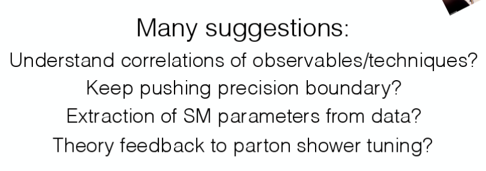

# BOOST 2017

Location: University at Buffalo

Time: Jul. 16 - Jul. 21, 2017

* [Boost Camp](#boostcamp)
* [Day 1](#day1)

## BOOST Camp

#### Lund Diagram

## Day 1

#### Theory Overview

#### Exp. Overview (by Lily Asquith)

## DNN

* DeepCSV [[Jan Kieseler @ CMS]](https://indico.cern.ch/event/579660/contributions/2582146/attachments/1495720/2327116/JK_MLatCMS.pdf)
     *  Almost 80%* b vs. light flavour discrimination efficiency for 1% misid. prob. 
     * Re-training of the DNN increased performance even (slightly) more (Re-trained on 40M jets from QCD and top-quark pair events)
     * First successful step towards DNN-based taggers in CMS

* DeepFlavor: Conv + Recurrent + Dense

## Fractal Observables

## CMS Open Data

* 
